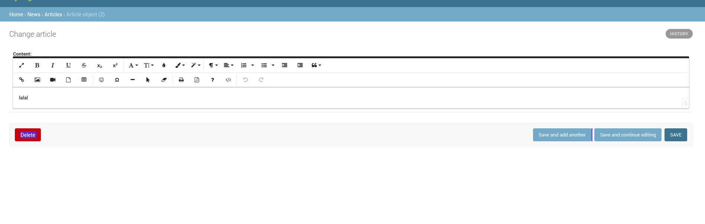

集成好看的 froala-editor 到 django-admin 
============

本文主要内容为将 [django-froala-editor](https://github.com/froala/django-froala-editor) 集成到 django-admin，并能自定义 django-froala-editor 所有设置。


### 安装 froala-editor

在 django-froala-editor 仓库中使用了 pip 的安装方式，使用这种方式能够快速的搭起应用，但本文推荐直接将 froala-editor 嵌入建立的项目中，将 froala-editor 变为项目下的一个 app,这样我们就能控制 froala-editor 的所有行为。

#### 下载 froala-editor

将 froala-editor 下载到本地，直接下载或者 `git clone `　的方式都可以。我使用 git 的方式

```

git clone https://github.com/froala/django-froala-editor.git

```

下载好之后将文件夹下的 froala-editor 文件夹直接复制到自己的项目文件夹下。


#### 配置 django-setting

接下来配置 froala-editor 设置。

首先是 `settings.py`，将 froala-editor 加入到 apps 中

```python

INSTALLED_APPS = [
    'django.contrib.admin',
    'django.contrib.auth',
    'froala_editor',
    'news',   
    'django.contrib.contenttypes',
    'django.contrib.sessions',
    'django.contrib.messages',
    'django.contrib.staticfiles',
]


```

然后在 `urls.py` 中加入 froala-editor 路由

```python 

from django.contrib import admin
from django.urls import path, include

urlpatterns = [
    path('froala_editor/', include('froala_editor.urls')),
    path('admin/', admin.site.urls),
]


```

#### 自建一个承载编辑器的项目

新建一个叫 news 的 app,建立过程不表。

首先在 `models.py` 中建立数据表

```python
from django.db import models
from froala_editor.fields import FroalaField

class Article(models.Model):
    content = FroalaField()

```

然后在 `admin.py` 中注册 `Article`

```python

from django.contrib import admin
from .models import Article


@admin.register(Article)
class ArticleAdmin(admin.ModelAdmin):
    pass

```

至此，代码部分已经全部完成，一通 django 操作之后就可以打开 admin 网址看到内容了。



### 魔改 froala-editor

froala-editor 的所有代码都在 项目下面，我们可以按需定制其中的代码，这里以定制上传图片行为为例。

froala-editor 原本的代码为

```python


def image_upload(request):
    if 'file' in request.FILES:
        the_file = request.FILES['file']
        allowed_types = [
            'image/jpeg',
            'image/jpg',
            'image/pjpeg',
            'image/x-png',
            'image/png',
            'image/gif'
        ]
        if not the_file.content_type in allowed_types:
            return HttpResponse(json.dumps({'error': _('You can only upload images.')}),
                                content_type="application/json")
        # Other data on the request.FILES dictionary:
        # filesize = len(file['content'])
        # filetype = file['content-type']

        # 获取上传路径
        upload_to = getattr(settings, 'FROALA_UPLOAD_PATH', 'uploads/froala_editor/images/')
        #　将图片保存在指定路径
        path = storage.save(os.path.join(upload_to, the_file.name), the_file)
        # 生成图片访问路径
        link = request.build_absolute_uri(storage.url(path))

        # return JsonResponse({'link': link})
        return HttpResponse(json.dumps({'link': link}), content_type="application/json")

```

在核心代码上简单做了注解。接下来魔改一下，假设我们希望图片通过 nginx 走静态配置而不是走 django 应用，所以需要修改图片访问路径

```python

# 获取上传路径
# １、在 settings.py 中修改　FROALA_UPLOAD_PATH 为静态路径
upload_to = getattr(settings, 'FROALA_UPLOAD_PATH', 'uploads/froala_editor/images/')
#　将图片保存在指定路径
path = storage.save(os.path.join(upload_to, the_file.name), the_file)
# 生成图片访问路径
# 2、重新定义访问路径，比如
link = request.META.host + "/static/" + path # 仅做讲解用，自己实现的时候按需修改
# link = request.build_absolute_uri(storage.url(path))


```

以上，我们就修改了图片上传的行为。

其他的魔改行为同理，读懂代码，按需定制

### 最后

froala-editor 是收费的，我这边耍小聪明破解了 froala-editor ，但不会给出破解方法。支持正版在所不辞。

本文收录于 `shadow`。

zhouxin.20190511